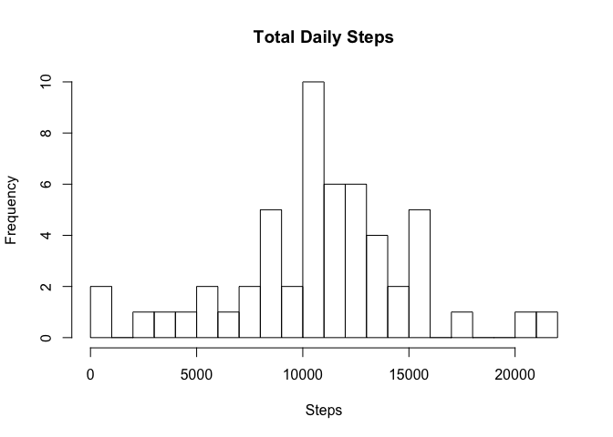
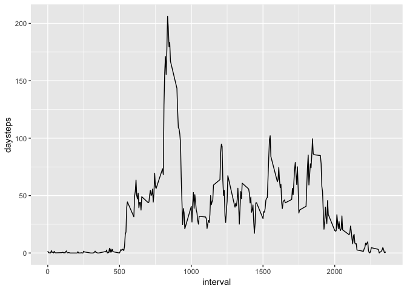
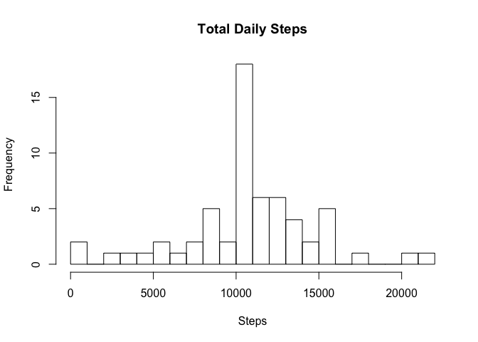
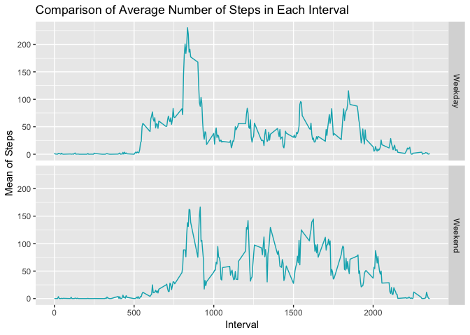

## Loading and preprocessing the data

```r
setwd('/Users/gijsbartholomeus/Documents/Datasciencecoursera/Reproducible_data/Week2/RepData_PeerAssessment1/')
acti <- read.csv(file = 'activity.csv')
actidate <- acti %>% select(date, steps) %>% na.omit() %>% group_by(date) %>% summarize(daysteps=sum(steps)) 
```

## Creating a histogram with steps per day

```r
hist(actidate$daysteps,xlab = "Steps", ylab = "Frequency", main = "Total Daily Steps", breaks = 20)
```

<!-- -->

## Calculate the mean and median steps per day

```r
mean(actidate$daysteps)
```

```
## [1] 10766.19
```

```r
median(actidate$daysteps)
```

```
## [1] 10765
```

## plot line with steps per time interval

```r
actiinterval <- acti %>% select(interval, steps) %>% na.omit() %>% group_by(interval) %>% summarize(daysteps=mean(steps)) 
ggplot(actiinterval, aes(x=interval, y=daysteps))+ geom_line()
```

<!-- -->

## See which day has the maximum daysteps value

```r
actiinterval[which(actiinterval$daysteps== max(actiinterval$daysteps)),]
```

```
## # A tibble: 1 x 2
##   interval daysteps
##      <int>    <dbl>
## 1      835     206.
```

## calculate the total sum of missing values

```r
sum(is.na(acti))
```

```
## [1] 2304
```

## replace missing values with mean of column

```r
replacewithmean <- function(x) replace(x, is.na(x), mean(x, na.rm = TRUE))
NAmean <- acti%>% group_by(interval) %>% mutate(steps= replacewithmean(steps))
```

## create histogram with total steps day with filled in mean

```r
FullSummedDataByDay <- aggregate(NAmean$steps, by=list(NAmean$date), sum)
names(FullSummedDataByDay)[1] ="date"
names(FullSummedDataByDay)[2] ="totalsteps"
head(FullSummedDataByDay,15)
```

```
##          date totalsteps
## 1  2012-10-01   10766.19
## 2  2012-10-02     126.00
## 3  2012-10-03   11352.00
## 4  2012-10-04   12116.00
## 5  2012-10-05   13294.00
## 6  2012-10-06   15420.00
## 7  2012-10-07   11015.00
## 8  2012-10-08   10766.19
## 9  2012-10-09   12811.00
## 10 2012-10-10    9900.00
## 11 2012-10-11   10304.00
## 12 2012-10-12   17382.00
## 13 2012-10-13   12426.00
## 14 2012-10-14   15098.00
## 15 2012-10-15   10139.00
```

```r
hist(FullSummedDataByDay$totalsteps, xlab = "Steps", ylab = "Frequency", main = "Total Daily Steps", breaks = 20)
```

<!-- -->

compare old and new median and mean

```r
oldmean <- mean(actidate$daysteps, na.rm = TRUE)
newmean <- mean(FullSummedDataByDay$totalsteps)

oldmedian <- median(actidate$daysteps, na.rm = TRUE)
newmedian <- median(FullSummedDataByDay$totalsteps)

oldmean
```

```
## [1] 10766.19
```

```r
newmean
```

```
## [1] 10766.19
```

```r
oldmedian
```

```
## [1] 10765
```

```r
newmedian
```

```
## [1] 10766.19
```

create a factor variable with weekend or weekday

```r
NAmean$WeekendOrWeekday <- ifelse(weekdays(as.Date(NAmean$date)) %in% c("Monday", "Tuesday", "Wednesday", "Thursday", "Friday"), "Weekday", "Weekend")
FinalWeek <- NAmean %>% group_by(interval, WeekendOrWeekday) %>% summarise(Mean = mean(steps))
```

create a final blue colored line plot with total steps per interval for weekdays and weekend

```r
ggplot(FinalWeek, aes(interval,Mean)) + geom_line(color = "#00AFBB") + facet_grid(WeekendOrWeekday ~ .) + xlab("Interval") + ylab("Mean of Steps") + ggtitle("Comparison of Average Number of Steps in Each Interval")
```

<!-- -->
